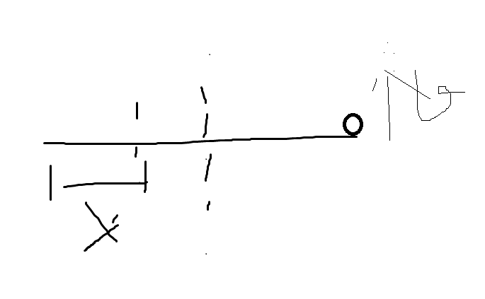

## 质点运动学

### 运动学基本关系

基本量：位置、速度、加速度

### 物体关联问题

##### 角动量守恒

3.41：质量m的人站在质量M长l的竹筏的一端，人和竹筏静止。若人以速度v垂直起跳，求竹筏获得的角速度。
- 法1：质心轴
$J_c\omega=L\\
J_c=\frac1{12}Ml^2,L=mv\frac l2\\
\omega=\frac{6mv}{Ml}\\$
- 法2：瞬时轴
$角动量：J\omega-mv(l-x)=0\\
J=\frac{1}{12}Ml^2+M(\frac l2 -x)^2\\
动量：MV_c-mv=0\\
V_c=\omega(\frac l2-x)\\
\omega=\frac{6mv}{Ml}\\$

- 法3：动量守恒+角动量守恒
$动量：MV_c-mv=0\\
J=\frac{1}{12}Ml^2\\
角动量：J\omega=-MV\frac12l$